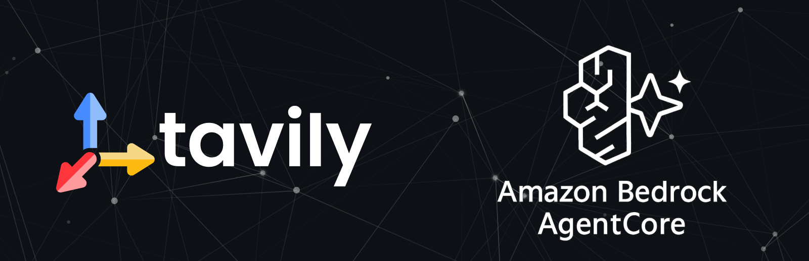
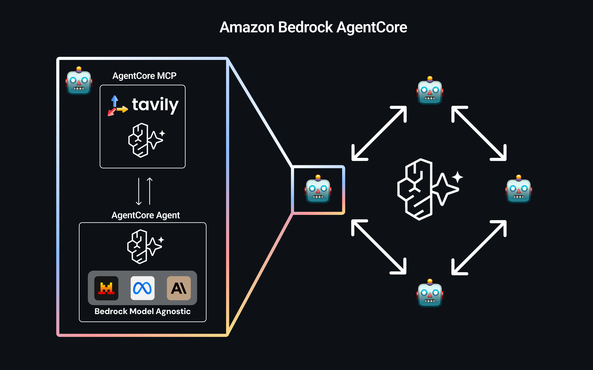

# Amazon Bedrock AgentCore Research Summary

## Overview

Amazon Bedrock AgentCore is AWS's comprehensive, enterprise-grade platform designed to deploy and operate AI agents securely at scale. Currently in preview (launched July 16, 2025), AgentCore addresses the critical gap between AI agent prototypes and production-ready implementations by providing purpose-built infrastructure, powerful tools, and essential enterprise controls.

## Tavily's AgentCore MCP

Setting up our MCP through AgentCore gives you the ability to host an instance of the Tavily MCP remotely in your own VPC. Having the MCP in your own VPC ensures the highest levels of security, scalability, and observability. Note: the remote MCP will be served in your own VPC but will still communicate with the core tavily services that live outside your own VPC. 

In the next wave of AI, we’ll step into a world where billions of agents communicate effortlessly and intelligently with one another. Each AgentCore agent can integrate with the Tavily MCP, operating within a secure, enterprise-grade framework. These agents can also connect to a wide range of other integrations supported by AgentCore, such as Slack, Jira, Salesforce, and Zoom. By combining Tavily's web access with other powerful tools, we unlock a universe of infinite possibilities, all in the comfort of the AgentCore framework.