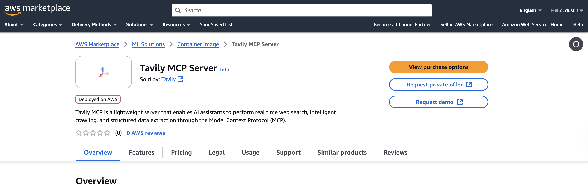
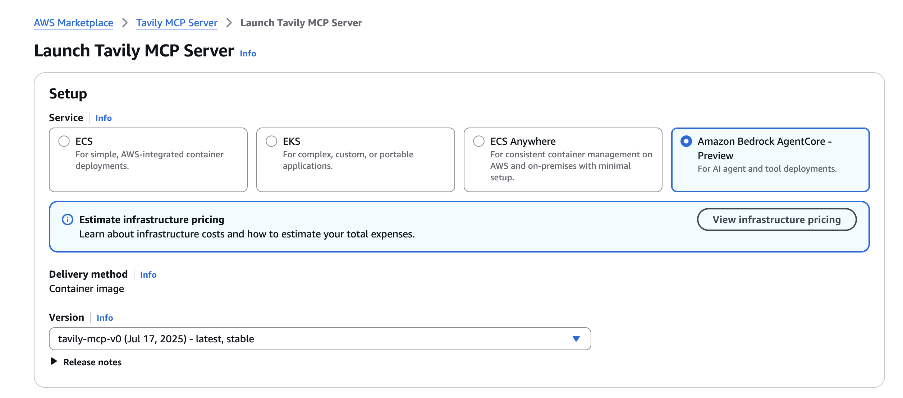

## Setup guide

### Step 1
- Visit the AWS Marketplace to view our [listing](https://aws.amazon.com/marketplace/pp/prodview-twjga5bwmoszq)



- Select `View purchase options`
- Scroll down and select `Subscribe`
- Wait until your request has been processed .... 
- There will be a pop-up once the request has been processed. Click `Launch your software`


### Step 2
- Select `Amazon Bedrock AgentCore-Preview` 



The Launch Guide can also be found on the marketplace, but we will also display the entire guide here.

## Step 1: Review Usage Instructions

# Tavily MCP Initialization Guide

This guide walks you through initializing the Tavily MCP (Model Context Protocol).

## Prepare Configuration Fields

Replace the following placeholders in the command seen in step 2:

- `<AGENT_NAME>` - Any name you wish
- `<AGENT_DESCRIPTION>` - Any description you wish
- `<AGENT_ROLE_ARN>` - An IAM role ARN with the required permissions (see below)
- `<ENVIRONMENT_VARIABLE>` - Set to your `TAVILY_API_KEY` You can get a **free API key** by signing up at [tavily.com](https://www.tavily.com/)

## IAM Role Trust Policy

Create/add an IAM role ARN with the below permissions. Under **Trust relationships**, set the **Trusted entities** field to:

```json
{
  "Version": "2012-10-17",
  "Statement": [
    {
      "Sid": "Statement1",
      "Effect": "Allow",
      "Principal": {
        "Service": "bedrock-agentcore.amazonaws.com"
      },
      "Action": "sts:AssumeRole"
    }
  ]
}
```

## Invocation

Once you execute the command in step 2, you will get the following output

```json
{
    "agentRuntimeArn": "...........................",
    "workloadIdentityDetails": {
        "workloadIdentityArn": ".................."
    },
    "agentRuntimeId": "...............................",
    "agentRuntimeVersion": "..",
    "createdAt": "...........................................",
    "status": ".................................................."
}
```
You need to replace the `<AGENT_RUNTIME_ARN>` in **Step 3: Invoke agent runtime** with the output from step 2.

### List of Payloads:

- '{"jsonrpc": "2.0", "id": 1, "method": "tools/list"}'
- '{ "jsonrpc": "2.0", "id": "1", "method": "tools/call", "params": { "name": "tavily_search", "arguments": { "query": "latest AI news", "max_results": 10 } } }'
- '{ "jsonrpc": "2.0", "id": "1", "method": "tools/call", "params": { "name": "tavily_extract", "arguments": { "urls": ["www.tavily.com"]} } }'
- '{ "jsonrpc": "2.0", "id": "1", "method": "tools/call", "params": { "name": "tavily_crawl", "arguments": { "url": "www.tavily.com"} } }'
- '{ "jsonrpc": "2.0", "id": "1", "method": "tools/call", "params": { "name": "tavily_map", "arguments": { "url": "www.tavily.com"} } }'

For more details on the tool arguments, visit https://docs.tavily.com/documentation/api-reference/endpoint/search 

## Step 2: Host on Amazon Bedrock AgentCore - Preview
Use Amazon Bedrock AgentCore - Preview to securely deploy, run, and scale AI agents and tools built on any framework. To host on Amazon Bedrock AgentCore - Preview, replace the placeholders according to the vendor's instructions, then run the following command from AWS CloudShell  or a Linux or macOS terminal.

**Prerequisites**

If using the AWS CLI, [install](https://docs.aws.amazon.com/cli/latest/userguide/getting-started-install.html) and [set up](https://docs.aws.amazon.com/cli/latest/userguide/getting-started-quickstart.html) the CLI.

```bash
aws bedrock-agentcore-control create-agent-runtime \
  --region us-east-1 \
  --agent-runtime-name "<AGENT_NAME>" \
  --description "<AGENT_DESCRIPTION>" \
  --agent-runtime-artifact '{
    "containerConfiguration": {
      "containerUri": "709825985650.dkr.ecr.us-east-1.amazonaws.com/tavily/tavily-mcp:v6"
    }
  }' \
  --role-arn "<AGENT_ROLE_ARN>" \
  --network-configuration '{
    "networkMode": "PUBLIC"
  }' \
  --protocol-configuration '{
    "serverProtocol": "MCP"
  }' \
  --environment-variables '{
    "<ENVIRONMENT_VARIABLE>": "<VALUE>"
  }'

```

## Step 3: Invoke agent runtime Info

**Invoke with CLI**

Once the previous command completes, you will receive an agent runtime ARN. Use the agent runtime ARN in following command to invoke your product.

```bash
export PAYLOAD='{ "jsonrpc": "2.0", "id": 1, "method": "tools/list", 
  "params": { "_meta": { "progressToken": 1}}}'

aws bedrock-agentcore invoke-agent-runtime \
  --agent-runtime-arn "<AGENT_RUNTIME_ARN>" \
  --content-type "application/json" \
  --accept "application/json, text/event-stream" \
  --payload "$(echo -n "$PAYLOAD" | base64)" output.json
```

listing payloads again here
- '{"jsonrpc": "2.0", "id": 1, "method": "tools/list"}'
- '{ "jsonrpc": "2.0", "id": "1", "method": "tools/call", "params": { "name": "tavily_search", "arguments": { "query": "latest AI news", "max_results": 10 } } }'
- '{ "jsonrpc": "2.0", "id": "1", "method": "tools/call", "params": { "name": "tavily_extract", "arguments": { "urls": ["www.tavily.com"]} } }'
- '{ "jsonrpc": "2.0", "id": "1", "method": "tools/call", "params": { "name": "tavily_crawl", "arguments": { "url": "www.tavily.com"} } }'
- '{ "jsonrpc": "2.0", "id": "1", "method": "tools/call", "params": { "name": "tavily_map", "arguments": { "url": "www.tavily.com"} } }'